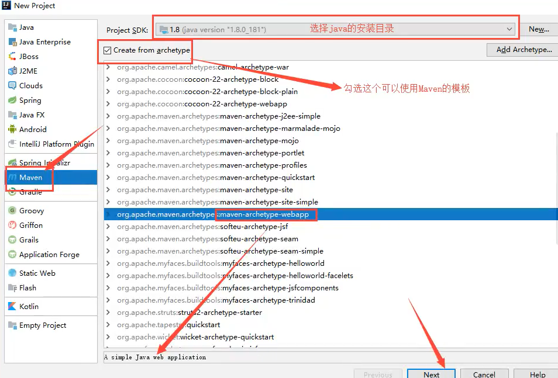
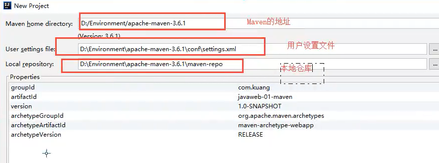
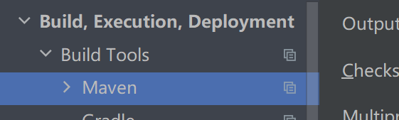
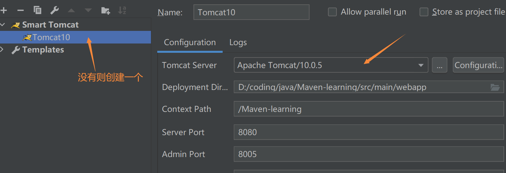
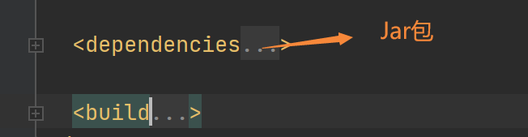

### 5 Maven

#### 是什么

Maven用来**项目构建，管理，jar包下载**，可以下载source并关联source

#### 本地仓库

设置本地仓库

```
config文件夹下
setting.xml
<localRepository>E:\Program Files\apache-maven-3.8.1-bin\apache-maven-3.8.1\repo</localRepository>
```

#### IDEA中使用

##### 1 创建项目





然后等待项目初始化完毕

##### 2 maven设置



##### 3 创建一些文件夹


##### 4 在IDEA中配置Tomcat



##### 5 pom文件



## 6. Servlet

#### 是什么

servlet实现了管理web动态资源的一个接口，开发人员只需要实现这个接口即可

#### IDEA

新建一个空项目，删除src文件，在pom文件中加入依赖

```xml
<dependency>
            <groupId>javax.servlet</groupId>
            <artifactId>javax.servlet-api</artifactId>
            <version>4.0.1</version>
            <scope>provided</scope>
        </dependency>
        <dependency>
            <groupId>javax.servlet.jsp</groupId>
            <artifactId>jsp-api</artifactId>
            <version>2.2</version>
            <scope>provided</scope>
        </dependency>
```

在这个项目中新建module子项目,子项目的依赖中加入parent

```xml
<parent>
    <groupId>org.example</groupId>
    <artifactId>Servlet</artifactId>
    <version>1.0-SNAPSHOT</version>
  </parent>
```

#### 编写一个类

新建一个包，编写HelloServlet类，里面实现Servlet接口；

之后web.xml中写入映射

```xml
 <servlet>
    <servlet-name>Hello</servlet-name>
    <servlet-class>com.example.HelloServlet</servlet-class>
  </servlet>
  <servlet-mapping>
    <servlet-name>Hello</servlet-name>
    <url-pattern>/hello</url-pattern>
  </servlet-mapping>
```

#### Mapping

```xml
  <servlet-mapping>
    <servlet-name>Hello</servlet-name>
      <url-pattern>/hello*</url-pattern>
  </servlet-mapping>

  <servlet-mapping>
    <servlet-name>Hello</servlet-name>
      <url-pattern>/*</url-pattern>
  </servlet-mapping>
```

#### ServletContext

可以用来共享数据

```java
context.setarrtibute(arr_name, string );
getArrtribute();
```

#### 读取资源文件

properties

* 在resource 目录下建立properties文件
* 在java目录下建立properties文件

#### Response

##### 下载文件

##### 验证码

##### 重定向

#### Cookie，Session

cookie是客户端技术，session是服务器技术

