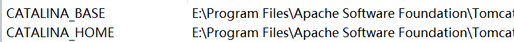

#### tomcat安装

一闪而过排查

start.bat  最后加pause； start 改为run

最后改用monitor tomcat

##### 端口被占用

netstat -ano|findstr "8080" # 查看80端口被哪些占用

#### 环境变量



#### tomcat部署应用

https://www.cnblogs.com/ysocean/p/6893446.html


**①、进入到 apache-tomcat-7.0.52\conf\Catalina\localhost 目录，新建一个 项目名.xml 文件**

　**②、在 那个新建的 xml 文件中，增加下面配置语句（和上面的是一样的,但是不需要 path 配置，加上也没什么用）**

　**③、在浏览器输入路径：localhost:8080/xml文件名/访问的文件名**

```
<Context docBase=``"D:/WebProject"` reloadable=``"true"` `/>
```

path:浏览器访问时的路径名

docBase:web项目的WebRoot所在的路径，注意是WebRoot的路径，不是项目的路径。其实也就是编译后的项目

应用的结构:

```
- index.html
- xx.html
- WEB-INF
  -classes : java程序
  -lib: web 依赖的jar
  -web.xml 网络的配置文件
- static 
  - css 
  - js
  - img
```


*reloadble:设定项目有改动时，tomcat是否重新加载该项目*