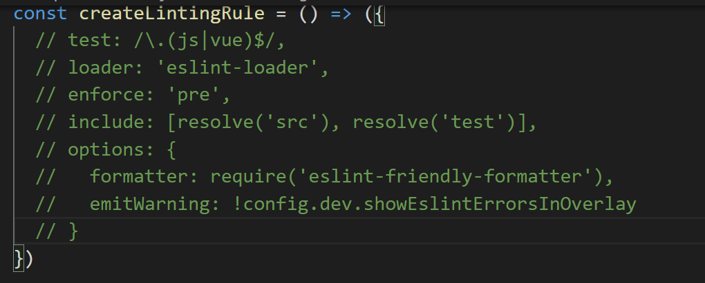

#### 安装npm

https://www.cnblogs.com/jianguo221/p/11487532.html


#### PowerShell：因为在此系统上禁止运行脚本，解决方法

https://www.jianshu.com/p/4eaad2163567

```shell
get-executionpolicy
set-executionpolicy remotesigned
```


创建项目

```
# 全局安装 vue-cli
$ cnpm install --global vue-cli
# 创建一个基于 webpack 模板的新项目
$ vue init webpack my-project

 cd my-project
$ cnpm install
$ cnpm run dev
```

#### 关闭eslint

.项目根目录 ---> build ---> webpack.base.conf.js 注释掉如下的代码

