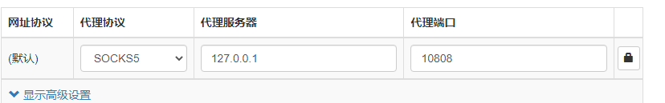

#### python环境

python下载：http://npm.taobao.org/mirrors/python/

pip下载使用国内镜像：

```
# cmd
# 正常用法
pip3 install requests
 
# 加-i用法
pip3 install -i https://pypi.tuna.tsinghua.edu.cn/simple requests
```

配置文件

windows下，直接在 C:\Users\Administrator 目录中创建一个pip目录，再新建文件pip.ini，填入以下代码。（这里用的是清华的数据）

```
# pip.ini
 
[global]
index-url = https://pypi.tuna.tsinghua.edu.cn/simple  # 设置源地址
[install]
trusted-host = pypi.tuna.tsinghua.edu.cn    # 信任此网站
```

ini文件记得把注释删去


python切换版本：

直接将python2的exe重命名为python2

```
py -2; // 改名后则不能使用这个命令
py -3
```


#### 常用软件

qq,钉钉,typora,微信电脑版

#### c++环境

#### git

国内镜像

https://npm.taobao.org/mirrors/git-for-windows/

```git
git clone 
```

登录

```
找到工程目录 (Project) 的.git文件夹，打开之后找到config文件，在最后边加上一句话
[user]
email=your email
name=your name
```

ssh

现在电脑上生成一个ssh key:

```shell
~/.ssh 文件夹下面
ssh-keygen -t rsa -C "email.com"
```

然后将电脑上的ssh key 复制到github上

测试是否成功配置ssh

```
ssh -T git@github.com
```

网址改成ssh网址


#### vscode

插件


#### 梯子

v2rayN 下载

https://github.com/2dust/v2rayN/releases/tag/4.20

v2ray-core下载

 https://github.com/v2fly/v2ray-core/releases

然后将core中文件拖到v2rayN中

或者直接下载corezip

* chrome插件下载：

https://github.com/FelisCatus/SwitchyOmega/releases

后缀名改为zip然后装入chrome

* 代理配置



#### 前端环境配置

安装nodejs

https://nodejs.org/zh-cn/download/

npm镜像配置

```shell
npm config set registry https://registry.npm.taobao.org
//查看 
npm config get registry
// 恢复官网 
npm config set registry https://registry.npmjs.org
```

* 安装vue

```
npm install vue -g
npm install vue-router -g
npm install vue-cli -g
```

* 在根目录

  ```
  vue init webpack projectname
  ```

* 进入项目

  ```
  cd projectname
  npm install 
  npm run dev chrome
  ```

#### chrome

* 下载chrome

* 登录google账号：

  同步：

  * 地址栏输入：chrome://sync-internals
    中间那列中下方，点击“Stop Sync (Keep Data)”，之后点击“Request Start”
    两个设备上的Chrome都进行一次这个操作


