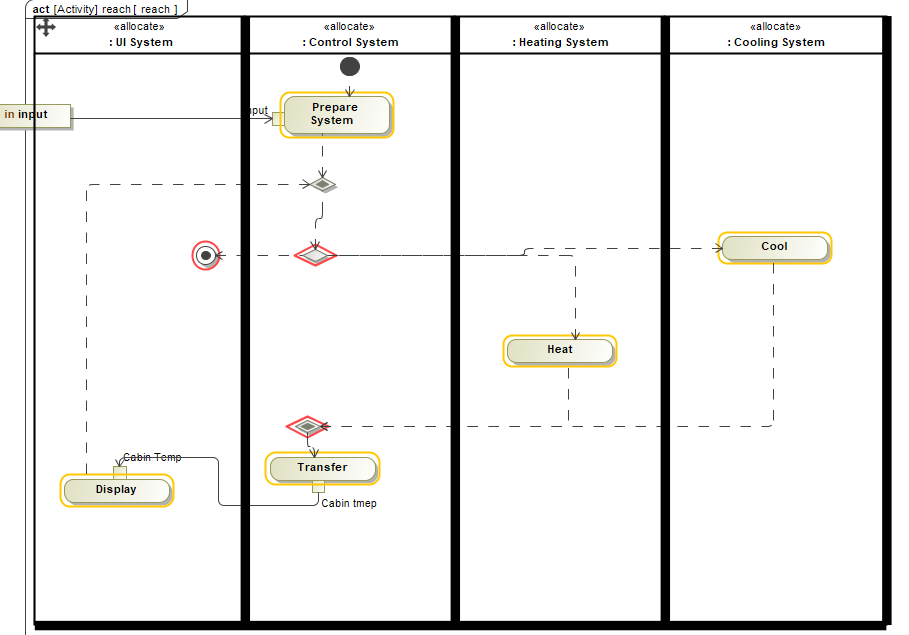

### 熟悉界面

### B1-W1 利益相关方需求分析-初始节点

建立需求表 

需求表是一种视图，可以自己填写或者从excel中粘贴

用户分组：element numbering

excel同步选项

### B3 系统上下文- 初始阶段

创建块和ibd

创建信号

点击图像可以更换图标

### B2 用例

用例图：

 

活动图：

右键用例 Feel ... ,新建活动图

### B4 有效性度量MOE

* 添加值属性： 点击block，再点击黑色的加号；

* 设置值属性的属性：右键，stereotype

### W2 功能分析

用活动图来细化

子系统对应响应的活动图

### W3 逻辑子系统

对于黑盒创建的块用bdd图和ibd图进行拓展

### B1-W1 最终阶段 

* 创建一个精化需求矩阵，

  Diagram - refine requirement matrix， 

  行是功能和MoE， 列是需求。

  

  

  