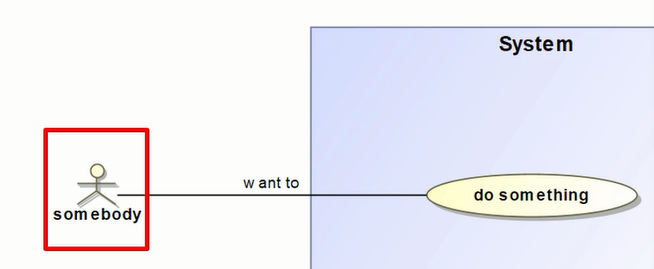

### 总图

#### 问题域目的

### B1-W1 利益相关方需要

### B3 系统上下文

* block ：一个可以独立存在的事物的抽象概念
  * 一种模型元素
  * 可以代表系统，子系统，组件，用户
  * 块通过名称和属性定义
* IBD图
  * 内部块图
  * 表达了系统的组成部分必须如何组合才能构建有效的系统
* 模块的结构特性
  * 组成部分属性
  * 引用属性
* 端口
  * 代理端口：由接口模块定义
  * 接口模块：一种特殊的模块，实现端口重用
  * 完整端口
* 连接器
  * 描述两个模块可以相互访问

### B2 用例场景分析

#### 用例图

* 概述

  从业务主角和业务功能两个视角来描述模型，确认模型是否符合业务功能

* 用例图元素

  * 执行者：表示操作当前系统的人或者物。标识法是一个火柴人

    

  * 系统边界

  * 用例：描述系统将执行的功能。标识法是个椭圆

  * 关联:标识法是一条直线。

  * 包含： 将某些常用的功能进行抽取，以实现重用

    

  * 扩展： 某用例执行时，扩展用例选择性执行

    

  * 泛化： 两个元素的继承关系

    

#### 用例场景的精化

* 可以用活动图和序列图来精化
* 活动图 swimlane
* 序列图 lifeline

#### 活动图

### B4 MoE 有效性度量

可以用块定义图 bdd视图

### W2 功能分析

功能分析是用活动图对用例分解的延续

### W3 逻辑子系统通信

### SS3 子系统设计

用ibd图来详细描述子系统