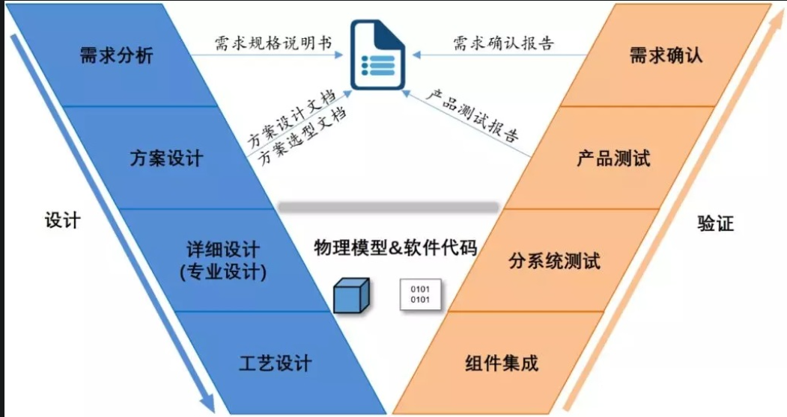
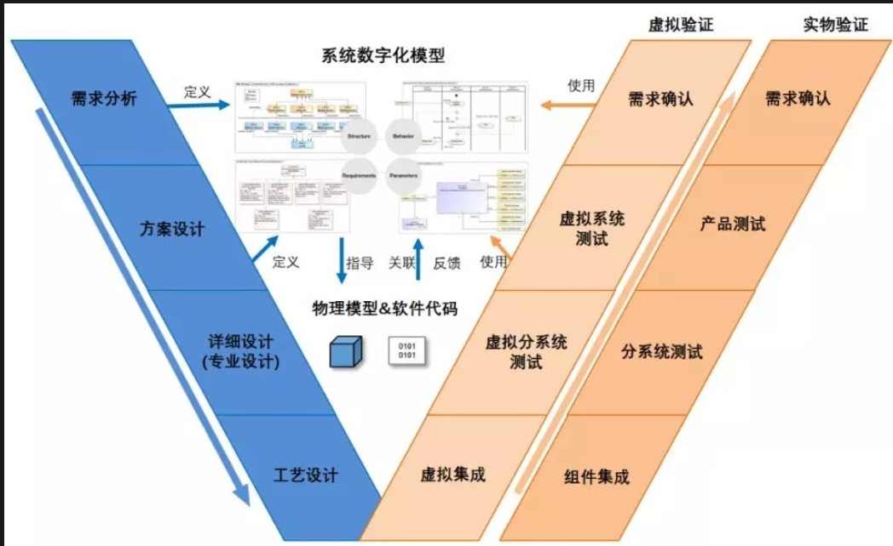
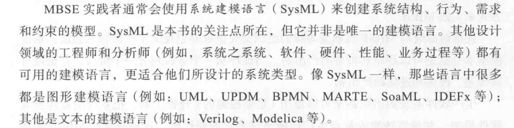
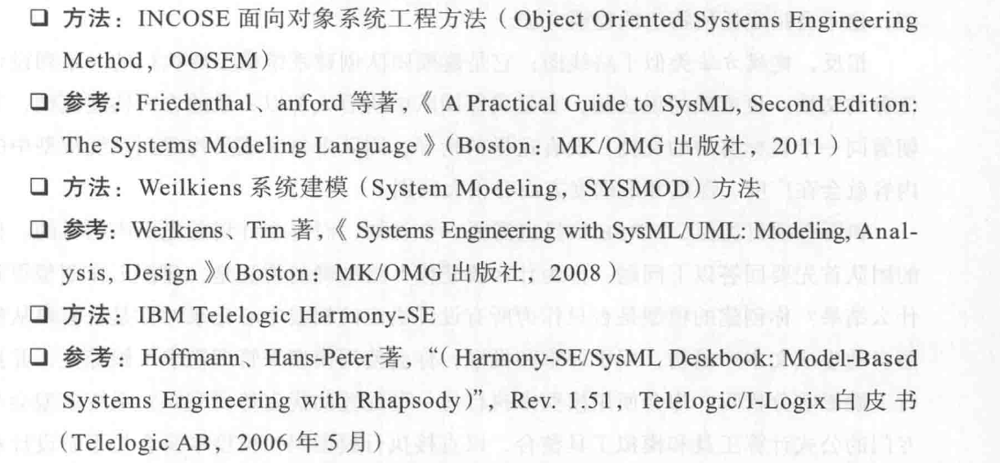
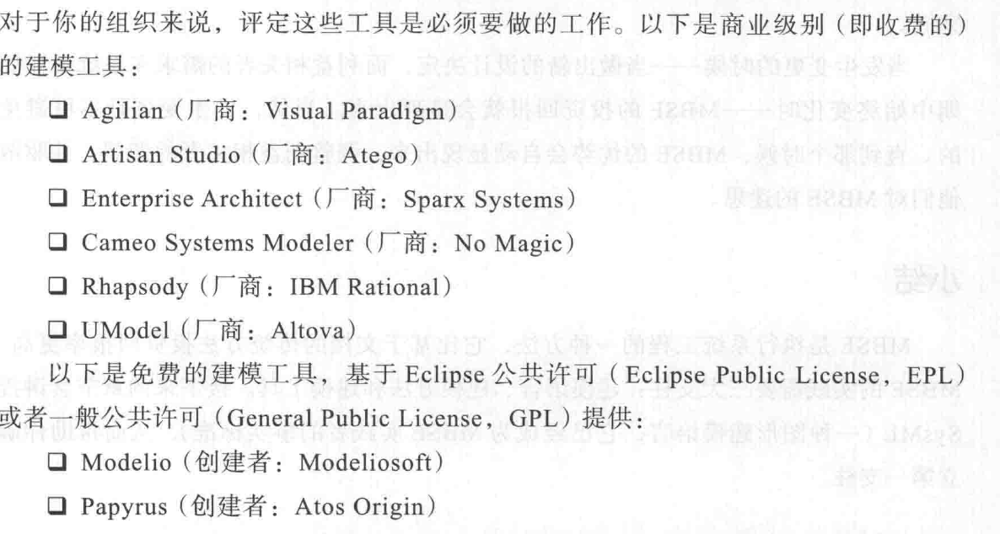
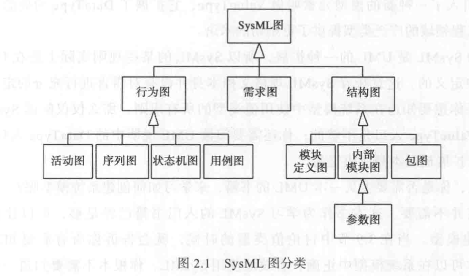
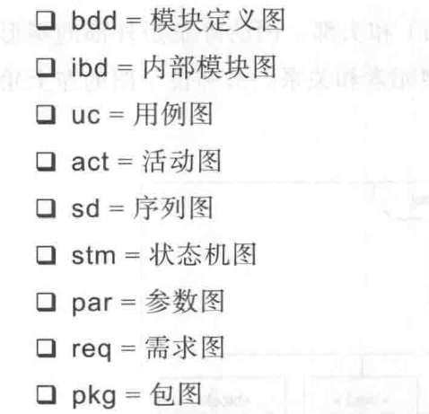

#### 为什么要MBSE？

现在我们的研制流程是依托于文档的，总体单位分析需求指标，和各分系统单位协调确认后形成各种任务书，然后逐级传递。在这个过程中很容易出错，几个文件中指标不一致，迭代速度缓慢，方案阶段无法分析清楚需求，到了初样还要修改。

首先什么是模型，模型是对现实世界一种抽象表达，数学公式、图纸、或者缩比实物都是模型；第二个什么是系统工程，系统工程是一种多学科全寿命周期的方法，它涉及技术和管理两个方面；然后什么是MBSE，MBSE采用数字模型代替文档进行沟通和记录，有几个特点： 

整合了多学科环境：各个学科都有自己的模型，但能够把这些模型整合到一起却比较难； 

覆盖真个寿命周期：方案、工程研制、系统验证、使用维护都要用到模型，目前工业上在方案用模型比较多，在工程研制、系统验证、使用维护中模型用得相对就少些；

 具有标准化的语言：当前采用的是sysml，从软件统一建模建模语言uml发展出来的一种用于系统工程的语言； 

自动化的环境：已经有很多大的开发商都有mbse工具，例如rhasphy，doors，通过这些工具，可以大大减少系统工程人员繁琐的重复性工作，帮助系统工程人员关注增加价值的工作并确保采用平衡的方法； 

与仿真结合：可以把模型用来做计算机仿真，例如控制领域已经有非常成熟的运动学仿真，而MBSE要把这些仿真扩展更大的范围，视觉、软件流程、电子、机械等等，最终在计算机上建立完全真实的虚拟世界，通过数字化的仿真可以极大降低研制的成本。

文档： 名词，动词，参数

MBSE：系统结构，行为，约束条件,MOE

##### 参考文档：

http://www.uml.org.cn/modeler/20190911.asp

https://www.zhihu.com/question/31958675

#### MBSE有哪些内容？

三个支柱：建模语言，建模方法，建模工具

#### 什么是SysML语言？

国际系统工程委员会和对象管理组织（ObjectManagement Group，简写为OMG）在UML2.0的基础上，定义了一种新的系统建模语言标准——SysML语言。该语言是一种图形建模语言，支持对包含人员、硬件、软件、过程、控制等在内的复杂系统进行说明、分析、设计、验证与确认，且独立于具体的方法与工具。

SysML 是一种图形语言

#### 模块定义图

